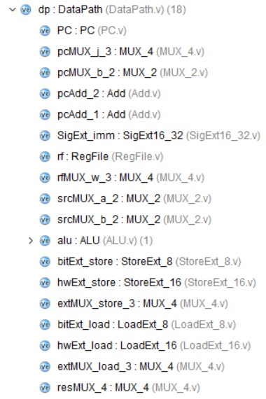
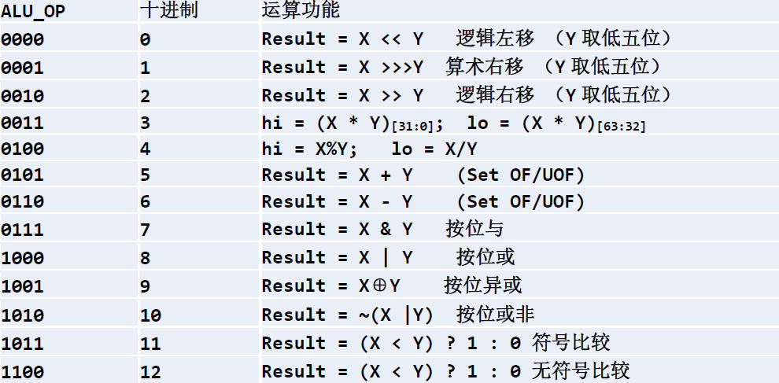
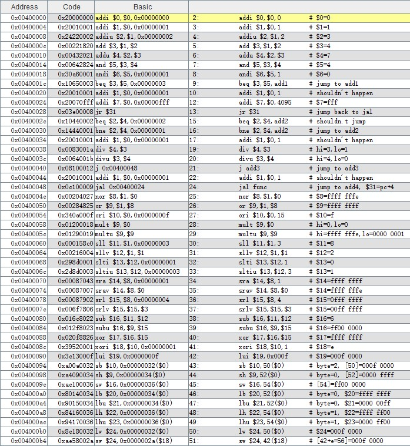

# MIPS-Single-39

MIPS单周期CPU，共支持39条指令。

按照 ***XJTU计组实验*** 要求完成，***MIPS-Lite*** 指令集的全部指令均检验并通过。

##  1.可执行命令（MIPS-Lite） 

| 1 | 2 | 3 | 4 | 5 | 6 | 7 | 8 | 9 | 10 | 11 | 12 | 13 |
| :-: | :-: | :-: | :-: | :-: | :-: | :-: | :-: | :-: | :-: | :-: |:-: | :-: |
| ADD | ADDI | ADDIU | ADDU | AND | ANDI |
| BEQ | BNE |
| DIV | DIVU |
| J | JAL | JR |
| LB | LBU | LH | LHU | LUI | LW |
| MULT | MULTU |
| NOR |
| OR | ORI |
| SB | SH | SLL | SLLV | SLTI | SLTIU | SRA |SRAV | SRL | SRLV | SUB | SUBU | SW |
| XOR | XORI |

##  2.控制单元CU设计 

为了方便设计，此处取消了alucontrol信号，直接由alu_op向ALU传递信息，这样便不再需要ALUDec模块，可以全部交给CU模块完成。
设计时，在初始CU的基础上逐个增加指令，并逐步完善CPU的框架。
CU设计代码见[ControlUnit.v](sources/ControlUnit.v)

##  3.数据通路DataPath设计 

在设计CU的过程中，其实已经逐步完善扩展出CPU框架图。
这样，数据通路只需要按照所设计的图纸将各部件实现并进行连接即可。

### 3.1 Add设计

作为单周期CPU，要在一个时钟周期内完成指令的读取和执行。由于一个部件在一个时钟周期只能完成一个操作，故必须采用“部件冗余”。Add模块用于包括PC自增及跳转指令在内的简单加法。

### 3.2 ALU设计

此处ALU参考 XJTU 实验课PPT上提供的完整alu_op表设计，并在此基础上添加unsign信号端口以对部分运算区分无符号和有符号模式。

**按照实验要求，ALU中加法部分采用基本门器件实现**
ALU设计代码见[ALU.v](sources/ALU.v)

### 3.3 PC设计

PC的实现其实就是一个D触发器，在时钟上升沿将数据打入，当reset有效时清零。

### 3.4 MUX_2，MUX_4设计

本实验设计中主要使用2，3，4路多路选择器，其中：

* 2路选择器用MUX_2实现；
* 3，4路多路选择器共同用MUX_4实现。

### 3.5 RegFile设计

参考XJTU计组实验4中寄存器代码实现。

### 3.6 SigExt设计

用于对16位立即数进行符号扩展。

### 3.7 StoreExt_8，StoreExt_16设计

用于sb,sh指令，对要写入DM的数据进行预处理。

### 3.8 LoadExt_8，LoadExt_16设计

用于lb,lbu,lh,lhu指令,对从DM读出，要写入寄存器的数据进行处理，通过unsign信号区分有符号扩展和无符号扩展。

### 3.9 DataPath连接

将上述各模块按照框架图进行连接，得到数据通路模块。
代码见[DataPath.v](sources/DataPath.v)

##  4.存储器Memory设计 

这里要注意的是，将数据写入存储器需要时钟上升沿，而从存储器中读取数据确实时时可以进行的。

### 4.1 IM设计

IM通过读取相应的文件获取指令，并始终读出指令供CPU执行。

### 4.2 DM设计

简单存储器，参考XJTU计组实验4进行实现

##  5.MIPS-Lite指令集单周期CPU 

将上述3大模块整合连接得到MIPS模块，即最终的CPU。
代码见[MIPS.v](sources/MIPS.v)

##  6.测试 

通过MARS对“ [test-all.asm](asm\test-all.asm) ”进行汇编，结果如下所示。并将汇编所得到指令码以十六进制格式保存在文件“text_all.txt“中，由IM进行读取。

在Vivado中进行仿真，通过对比可知，仿真结果完全正确，MIPS-Lite指令集所有指令均实现成功。
